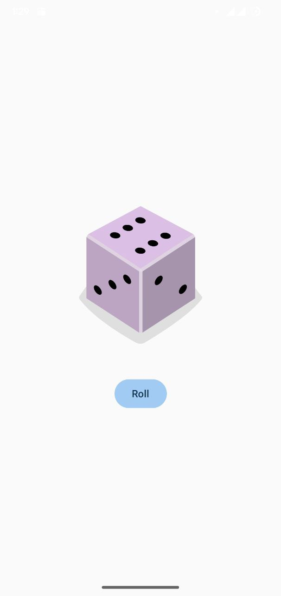

# Dice Roller App 🎲

This is the first interactive project from Unit 2 of the "Android Basics with Compose" course. This app features a dice image and a button. When the user taps the button, the app "rolls" the dice and displays a new random dice face.

## Project Overview

The primary goal of this project was to introduce state management in Jetpack Compose. The app remembers the current dice roll and updates the UI whenever the state changes.

## Screenshot

## Key Learnings

* **State Management:** Using `remember` and `mutableStateOf` to store and update the dice roll result.
* **User Interaction:** Using the `Button` composable and its `onClick` lambda to trigger logic.
* Implementing conditional logic (`when` statement) to display the correct dice image based on the current state.
